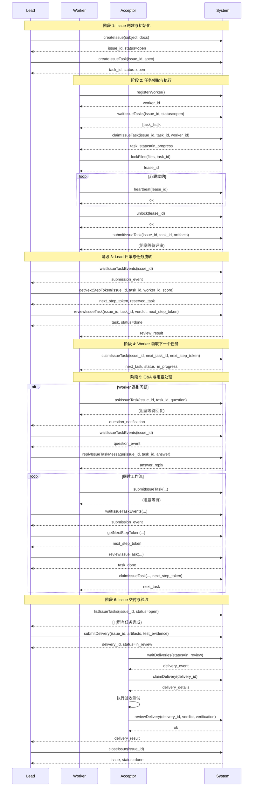
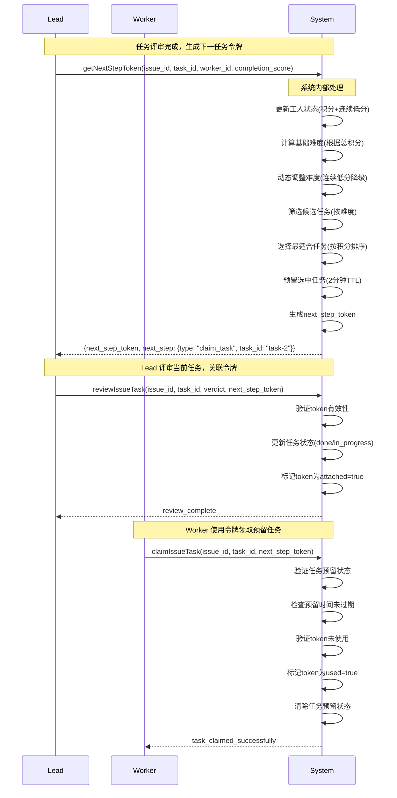
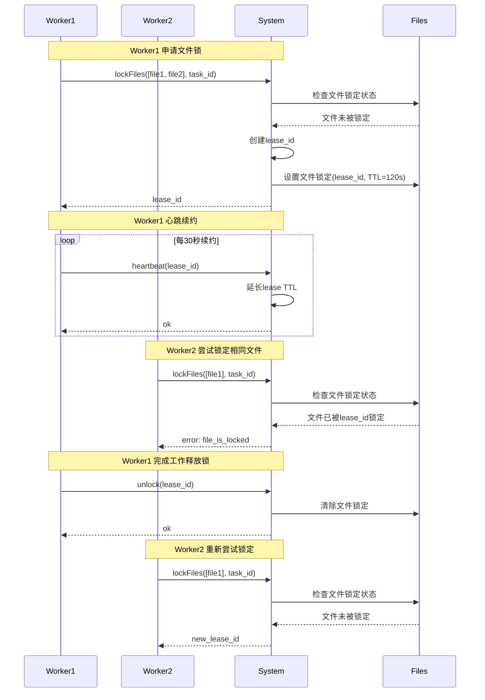
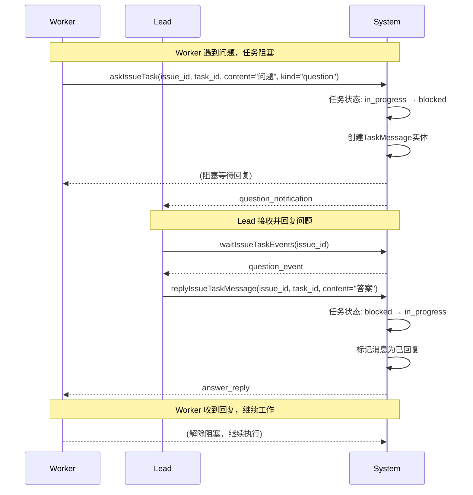
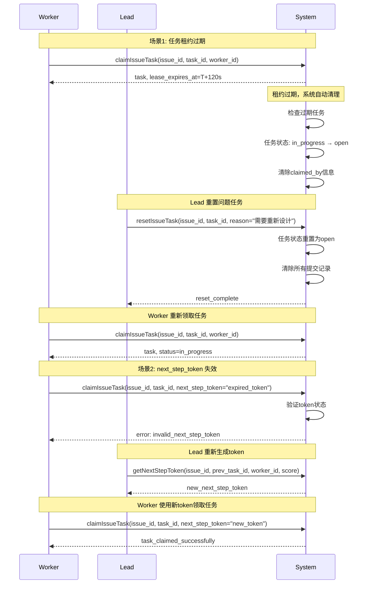
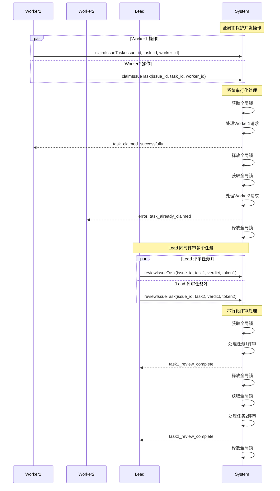
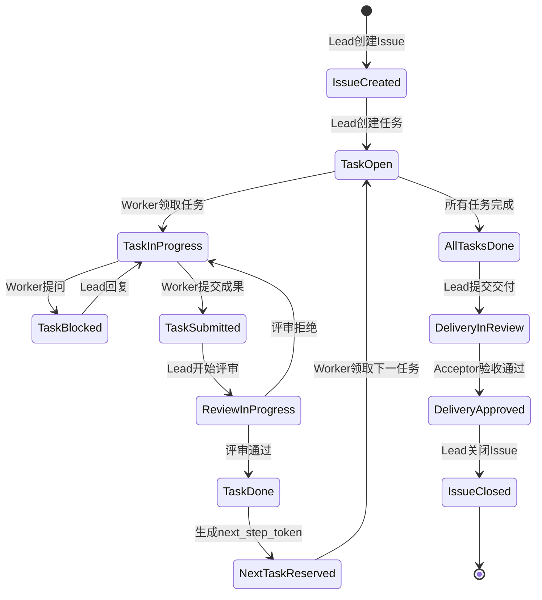

# Swarm MCP 三角色协作时序图

## 时序图使用说明

- **实线箭头**：同步调用，等待返回
- **虚线箭头**：异步通知，不等待
- **矩形框**：参与者角色
- **注释框**：阶段说明或系统内部处理
- **循环框**：重复操作（心跳续约、任务循环）

## 完整工作流时序图

## next_step_token 机制详细时序图

## 文件锁机制时序图

## Q&A 阻塞处理时序图

## 异常处理时序图

## 并发安全机制时序图

## 数据流状态转换图

## 关键时间节点说明

| 时间节点 | 操作 | 超时设置 | 说明 |
|---------|------|----------|------|
| T+0s | Worker领取任务 | - | 任务状态变为in_progress |
| T+30s | 第一次心跳 | 30s间隔 | Worker必须开始续约 |
| T+60s | 第二次心跳 | 30s间隔 | 继续保持文件锁 |
| T+90s | 第三次心跳 | 30s间隔 | 最后一次正常续约 |
| T+120s | 租约过期 | 120s TTL | 文件锁自动释放 |
| T+120s | 任务预留过期 | 120s TTL | next_step_token预留任务释放 |
| T+3600s | 评审等待 | 3600s默认 | Worker等待Lead评审的超时 |
| T+3600s | Q&A等待 | 3600s默认 | Worker等待Lead回复的超时 |

